# Four!

Jhin Bot is a Discord bot which scrapes op.gg for League of Legends champion statistics and displays them via Discord.py and BeautifulSoup. 

### Top Champions Per Role

A user can see the current top champions for the role of their choosing using the command `4!best-champs [role] ['5', '10', 'all']`.

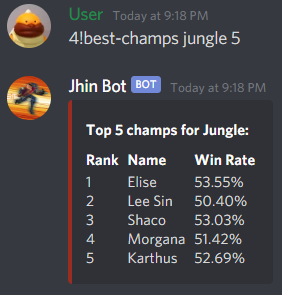 

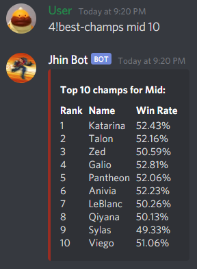 

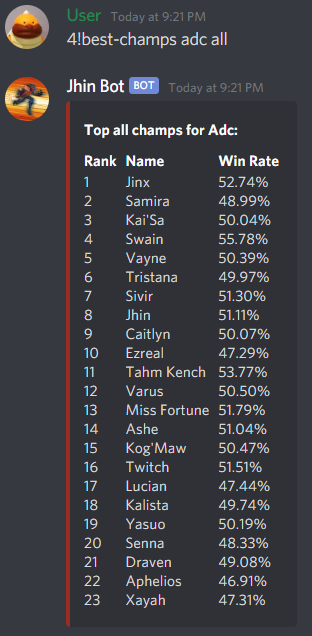

### Champion Statistics

Users can also see statistics for a particular champion for all of their roles with the command `4!get-stats [champion name]`.

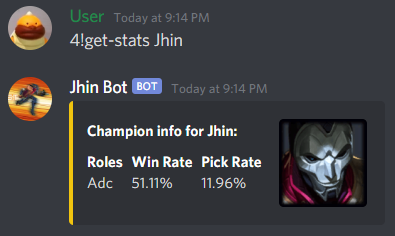

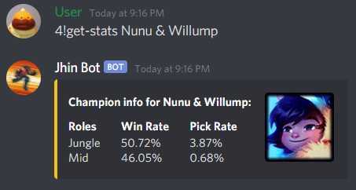

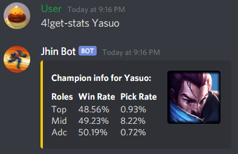

### Help and Bot Test

The bot also exhibits a help command as well as a test command for users to navigate the bot and see if it is alive, respectively.
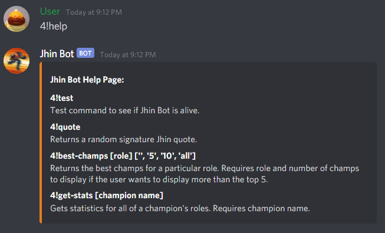

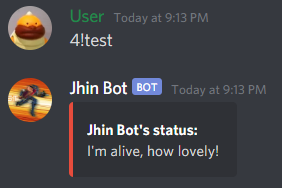

### Jhin Quotes 

And best of all, using `4!quote` Jhin Bot will return a randomly selected Jhin quote. 

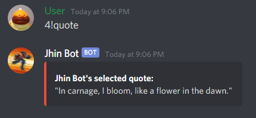

### Error Handling

For the functionality above, Jhin Bot also provides descriptive error messages for the user if they have inputted commands incorrectly.

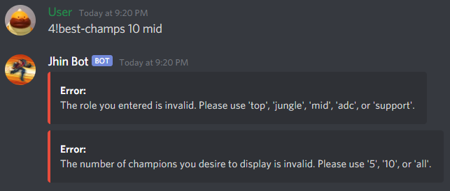

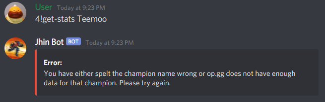